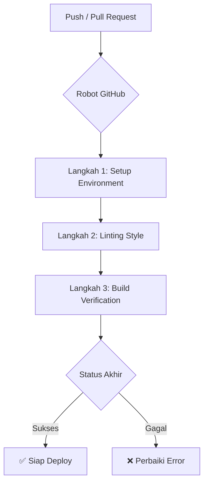

# 🚀 Panduan Setup Pipeline CI/CD

[](.github/workflows/ci.yml)
[](https://vercel.com/)

Dokumen ini merinci arsitektur *Continuous Integration & Deployment* (CI/CD) **Intan's Journal**. Pipeline ini dirancang untuk menjamin stabilitas kode dan efisiensi pengiriman fitur baru.

---

## 🛠️ Alur Kerja Otomatisasi

Kami menggunakan **GitHub Actions** untuk menjalankan pengujian otomatis pada setiap perubahan kode.



### Rincian Tahapan (`ci.yml`)

1.  **Environment Setup**: Menggunakan Node.js v20 dengan caching untuk mempercepat instalasi paket.
2.  **Linting**: Memastikan kode mematuhi standar ESLint proyek.
3.  **Build Check**: Simulasi proses build Next.js untuk mendeteksi error kompilasi lebih awal.

---

## 🔐 Manajemen Kredensial (Secrets)

Evironment variables sensitif tidak pernah disimpan dalam kode. Kami mengelolanya menggunakan **GitHub Secrets**.

> [!IMPORTANT]
> Jangan pernah melakukan commit file `.env.local` Anda. Gunakan GitHub CLI (`gh`) untuk mentransfer secrets dengan aman.

### Cara Mengonfigurasi via CLI

Pastikan Anda telah login menggunakan `gh auth login`, lalu jalankan:

```bash
# 1. Konfigurasi Endpoint Supabase
gh secret set NEXT_PUBLIC_SUPABASE_URL --body "URL_PROJECT_ANDA"

# 2. Konfigurasi Kunci Publik
gh secret set NEXT_PUBLIC_SUPABASE_ANON_KEY --body "ANON_KEY_ANDA"

# 3. Import massal (Jika file .env.local sudah rapi)
gh secret set -f .env.local
```

---

## 📅 Jadwal Pemeliharaan (Keep-Alive)

Kami memiliki workflow tambahan `keep-alive.yml` yang berjalan secara terjadwal untuk memastikan database Supabase tidak masuk ke mode *pause* akibat ketidakaktifan.

- **Frekuensi**: Sekali seminggu (Senin pukul 00:00 UTC).
- **Metode**: Melakukan query sederhana ke Supabase via script Node.js.

---

## 🚢 Deployment Production

Setiap perubahan yang berhasil melewati CI pada branch `main` akan dideploy secara otomatis ke **Vercel**. Status build dapat dipantau langsung di pull request atau di dashboard Vercel.

<div align="center">

Happy Shipping! 🚢✨

</div>
