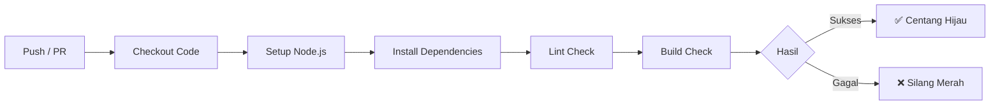

# 🚀 Panduan Setup Pipeline CI/CD

> [!NOTE]
> Dokumen ini menjelaskan pipeline *Continuous Integration & Deployment* untuk proyek **Intan Blog**. Dirancang untuk memastikan kualitas kode dan pengiriman yang mulus.

## 🌟 Ringkasan

Kami menggunakan **GitHub Actions** untuk mengotomatisasi proses pengujian dan build kami. Setiap kali Anda melakukan *push* kode atau membuka *Pull Request*, robot digital kami akan bekerja untuk memverifikasi bahwa semuanya aman terkendali! 🚢

| Fitur | Status | Deskripsi |
| :--- | :---: | :--- |
| **Linting** | ✅ | Memeriksa gaya kode dan potensi error menggunakan `eslint`. |
| **Building** | ✅ | Memastikan aplikasi Next.js dapat di-build tanpa error. |
| **Platform** | 🐧 | Berjalan di `ubuntu-latest`. |

---

## 🛠️ Pipeline (`ci.yml`)

Workflow kami berada di `.github/workflows/ci.yml`. Berikut adalah alur kejadiannya:



1.  **Checkout**: Mengambil kode terbaru dari repository.
2.  **Setup**: Menginstall Node.js (v20) dan mengkonfigurasi caching untuk kecepatan. ⚡
3.  **Install**: Menjalankan `npm ci` untuk instalasi yang bersih dan deterministik.
4.  **Lint**: Memastikan kualitas kode via `npm run lint`.
5.  **Build**: Mengompilasi aplikasi via `npm run build`.

---

## 🔐 Mengelola Secrets via CLI

Untuk memastikan proses build memiliki akses ke environment variables yang diperlukan (seperti kunci Supabase), kami menggunakan **GitHub Secrets**.

> [!IMPORTANT]
> **Keamanan Utama!** Jangan pernah commit file `.env` Anda ke repository. Gunakan metode di bawah ini untuk mentransfer environment variables lokal Anda ke GitHub dengan aman.

### Prasyarat

Pastikan Anda telah menginstall GitHub CLI (`gh`) dan sudah login.

```bash
gh auth login
```

### ⚡ Perintah Setup Cepat

Jalankan perintah ini di terminal Anda untuk mengatur secrets repository. Ganti nilai placeholder dengan key asli Anda dari `.env.local`.

#### 1. Set Supabase URL
```bash
gh secret set NEXT_PUBLIC_SUPABASE_URL --body "url_supabase_anda_disini"
```

#### 2. Set Supabase Anon Key
```bash
gh secret set NEXT_PUBLIC_SUPABASE_ANON_KEY --body "key_anon_supabase_anda_disini"
```

### 💡 Pro Tip: Import Massal
Jika Anda memiliki file `.env` yang bersih (tanpa komentar/kekacauan), Anda bisa langsung mengimportnya!

```bash
gh secret set -f .env.local
```
*(Pastikan Anda mengecek kembali file mana yang Anda kirim!)*

---

## 🏃‍♂️ Menjalankan Workflow

Workflow berjalan otomatis pada:
- Push ke branch `main`.
- Pull Request yang menargetkan branch `main`.

Anda dapat melihat progresnya di tab **Actions** pada repository GitHub Anda.

> [!TIP]
> Usahakan PR Anda kecil dan sering untuk mendeteksi masalah lebih awal! Happy Coding! ✨
