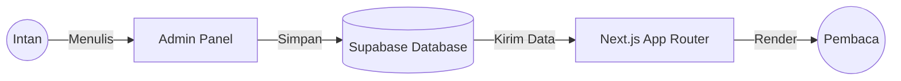

# 🏗️ Arsitektur & Cara Kerja

Website ini bukan sekadar tampilan, tapi sistem yang saling terhubung untuk menjamin keamanan dan kecepatan.

---

## 🗺️ Alur Data

Secara garis besar, website ini bekerja seperti ini:

1.  **Dashboard Admin**: Tempatmu berinteraksi.
2.  **Supabase**: Bertindak sebagai otak dan memori. Menyimpan semua tulisan, gambar, dan pengaturan profil.
3.  **Next.js**: Bertindak sebagai juru masak. Dia mengambil data dari Supabase dan menyajikannya dalam bentuk website yang cantik dan cepat.
4.  **Vercel**: Tempat "host" atau rumah website ini di internet.

## ⚡ Teknologi Utama

- **Server Components**: Fitur terbaru yang membuat website ini sangat ringan karena sebagian besar pekerjaan dilakukan di "dapur" (server) sebelum dikirim ke pembaca.
- **Incremental Static Regeneration (ISR)**: Website ini akan tetap kencang meskipun isinya ribuan post, karena dia "mengingat" halaman yang sudah di-render.
- **Edge Functions**: Digunakan untuk tugas-tugas kecil seperti menjaga koneksi database tetap hidup.

## 🔐 Lapisan Keamanan

- **Identity**: Menggunakan Supabase Auth untuk memverifikasi siapa yang masuk ke panel admin.
- **Walls**: Row Level Security (RLS) memastikan kalau ada hacker yang mencoba akses database langsung, mereka tetap tidak bisa melihat atau mengubah datamu tanpa izin.
